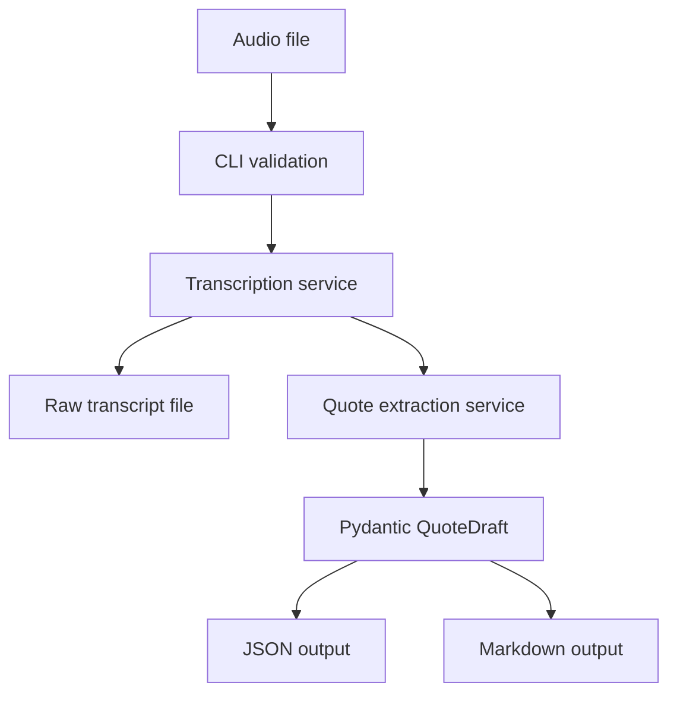

# InstantQuote

InstantQuote is a Phase 1 AI micro-SaaS foundation for UK tradespeople. It turns a short voice note recorded after a job visit into a structured, editable quote draft with customer details, job summary, line items, assumptions, exclusions, payment terms, and review flags.

This repository deliberately starts with a CLI vertical slice instead of a web app. The goal is to prove the core workflow safely: validate an audio file, transcribe it, extract only stated or strongly implied quote facts with OpenAI Structured Outputs, validate the result with Pydantic, and save raw, JSON, and Markdown outputs.

## Phase 1 Scope

This is Phase 1. There is no frontend, database, authentication, payment system, queue, cloud deployment, monitoring, or RAG layer yet.

## Installation

Install Python 3.12 and uv, then run:

```powershell
uv sync
```

## Environment

Create a local `.env` file from the example:

```powershell
Copy-Item .env.example .env
```

Set these values:

```text
OPENAI_API_KEY=your_api_key
INSTANTQUOTE_TRANSCRIPTION_MODEL=gpt-4o-mini-transcribe
INSTANTQUOTE_TEXT_MODEL=your_text_model
INSTANTQUOTE_OUTPUT_DIR=output
```

`INSTANTQUOTE_TEXT_MODEL` is required at runtime and is intentionally not hardcoded so the project can move to newer extraction models without code changes.

## CLI Usage

```powershell
uv run python scripts/create_quote_from_audio.py path\to\audio.m4a
```

Supported extensions are `.m4a`, `.mp3`, `.mp4`, `.mpeg`, `.mpga`, `.wav`, and `.webm`. Files larger than 25 MB are rejected before any API call.

## Checks

```powershell
uv run ruff check .
uv run mypy
uv run pytest
```

## Architecture



## Engineering Decisions

External API calls are isolated behind services so tests can exercise validation, rendering, and model behavior without calling OpenAI.

Pydantic v2 is the internal contract for quote data. The OpenAI Responses API is asked for schema-constrained output, then the application validates the response again before saving it.

Missing prices intentionally remain `null`. A tradesperson should review and add unknown costs instead of receiving invented numbers.

The transcript is treated as untrusted job content. Instructions inside the voice note cannot override extraction rules.

## Roadmap

- Phase 2: editable web UI for reviewing quote drafts.
- Phase 3: persistent storage for customers, quotes, and reusable line items.
- Phase 4: authentication and user accounts.
- Phase 5: quote export, email sending, and payment integrations.
- Phase 6: observability, deployment hardening, and production operations.
