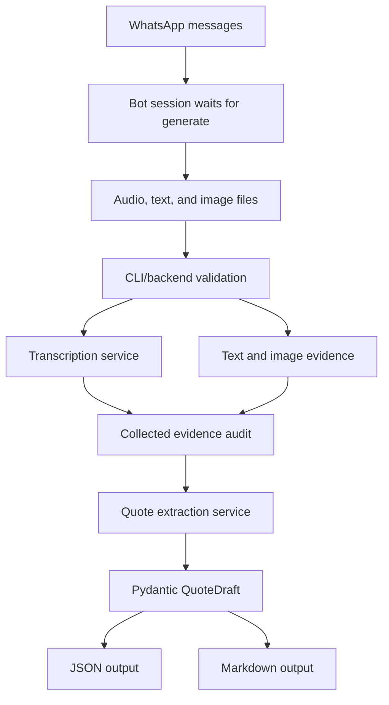

# InstantQuote

InstantQuote is a Phase 1 AI micro-SaaS foundation for UK tradespeople. It turns WhatsApp job evidence from a visit, such as voice notes, text notes, and photos, into a structured quote draft with customer details, job summary, line items, assumptions, exclusions, payment terms, and review flags.

This repository deliberately starts with a CLI vertical slice instead of a web app. The goal is to prove the core workflow safely: validate one or more input files, transcribe audio, pass text and images into quote extraction, extract only stated or strongly implied quote facts with OpenAI Structured Outputs, validate the result with Pydantic, and save audit, JSON, and Markdown outputs.

## Phase 1 Scope

This is Phase 1. There is no frontend, database, authentication, payment system, queue, cloud deployment, monitoring, WhatsApp bot implementation, PDF generation engine, or RAG layer yet.

The intended WhatsApp flow is:

1. The tradesperson sends any combination of text, photos, and one or more voice notes.
2. The bot stores those messages in the current quote session.
3. The bot waits until the tradesperson writes `generate`.
4. The backend summarizes all collected evidence into a quote draft.
5. The bot sends the draft back in WhatsApp for final confirmation or edits.
6. After confirmation, the separate bot/PDF service generates the customer-ready PDF.

## Installation

Install Python 3.12 and uv, then run:

```powershell
uv sync
```

## Environment

Create a local `.env` file from the example:

```powershell
Copy-Item .env.example .env
```

Set these values:

```text
OPENAI_API_KEY=your_api_key
INSTANTQUOTE_TRANSCRIPTION_MODEL=gpt-4o-mini-transcribe
INSTANTQUOTE_TEXT_MODEL=your_text_model
INSTANTQUOTE_OUTPUT_DIR=output
```

`INSTANTQUOTE_TEXT_MODEL` is required at runtime and is intentionally not hardcoded so the project can move to newer extraction models without code changes.

## CLI Usage

```powershell
uv run python scripts/create_quote_from_inputs.py path\to\voice-one.m4a path\to\notes.txt path\to\photo.jpg
```

The older single-audio wrapper still works:

```powershell
uv run python scripts/create_quote_from_audio.py path\to\audio.m4a
```

Supported audio extensions are `.m4a`, `.mp3`, `.mp4`, `.mpeg`, `.mpga`, `.wav`, and `.webm`. Supported text extensions are `.txt` and `.md`. Supported image extensions are `.jpg`, `.jpeg`, `.png`, and `.webp`.

Audio files larger than 25 MB, text files larger than 1 MB, and image files larger than 20 MB are rejected before any API call.

## Checks

```powershell
uv run ruff check .
uv run mypy
uv run pytest
```

## Architecture



## Engineering Decisions

External API calls are isolated behind services so tests can exercise validation, rendering, and model behavior without calling OpenAI.

Pydantic v2 is the internal contract for quote data. The OpenAI Responses API is asked for schema-constrained output, then the application validates the response again before saving it.

Missing prices intentionally remain `null`. A tradesperson should review and add unknown costs in WhatsApp instead of receiving invented numbers.

All user-provided evidence is treated as untrusted job content. Instructions inside voice notes, text notes, or photos cannot override extraction rules.

## Roadmap

- Phase 2: website, landing page, authentication, Stripe plans, business profile, logo upload, and quote history dashboard.
- Phase 3: persistent storage for quote sessions, generated PDFs, customers, and reusable business settings.
- Phase 4: production WhatsApp integration and PDF generation workflow.
- Phase 5: quote export, email sending, accepted/paid tracking, and payment links.
- Phase 6: observability, deployment hardening, and production operations.
